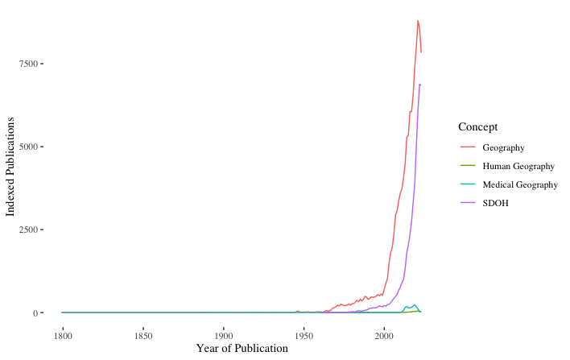
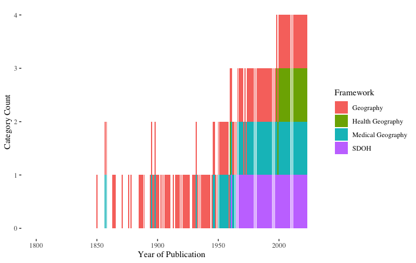
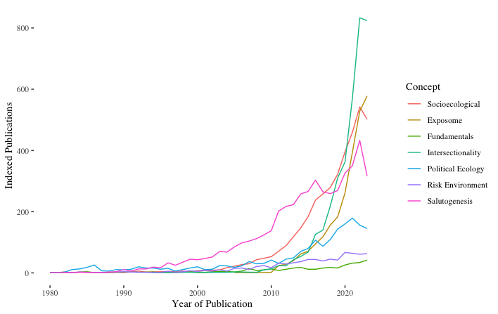

# rootingHealthGeog
Pubmed mini-analysis of conceptual themes & geography terms
 
Data can be downloaded directly from [PubMed](https://pubmed.ncbi.nlm.nih.gov/). 

## Indexed PubMed Studies By Year & Conceptual Framework



```
ggplot(main.df2,aes(x=year, fill=category, group=category)) + 
  geom_histogram(position='stack', stat="count") + 
  labs(fill = "Framework", x = "Year of Publication", y = "Category Count") +
  scale_fill_hue(labels = c("Geography","Health Geography","Medical Geography","SDOH")) +
  scale_x_date(limit=c(as.Date("1799-01-01"),as.Date("2023-12-30"))) +
  theme_tufte() 
```
## Geography Concepts in PubMed Publications since 1799.
The count of concepts is included for each year. 


```
ggplot(main.df2,aes(x=year,y=total,colour=category)) + 
  geom_line() + 
  labs(color = "Concept", x = "Year of Publication", y = "Indexed Publications") + 
  scale_color_hue(labels = c("Geography","Human Geography",
                             "Medical Geography", "SDOH")) +
  scale_x_date(limit=c(as.Date("1799-01-01"),as.Date("2023-12-30"))) +
  theme_tufte() 
```

## Indexed PubMed Studies By Year & SDOH Concept 



```
ggplot(main.df1,aes(x=yrs,y=total,colour=category)) + 
  geom_line() + 
  labs(color = "Concept", x = "Year of Publication", y = "Indexed Publications") + 
  theme_tufte() +
  scale_color_hue(labels = c("Socioecological", "Exposome","Fundamentals","Intersectionality",
                             "Political Ecology","Risk Environment","Salutogenesis")) +
  scale_x_date(limit=c(as.Date("1980-01-01"),as.Date("2023-12-30"))) 
```

