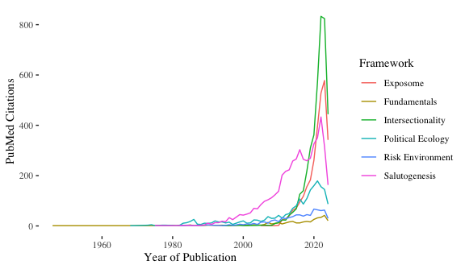

# rootingHealthGeog
 pubmed mini-analysis of conceptual themes & geography terms

## Indexed PubMed Studies By Year & Conceptual Framework

## Indexed PubMed Studies By Year & Geography Concept

## Geography Concepts in PubMed Publications since 1800
The count of concepts is included for each year. 

